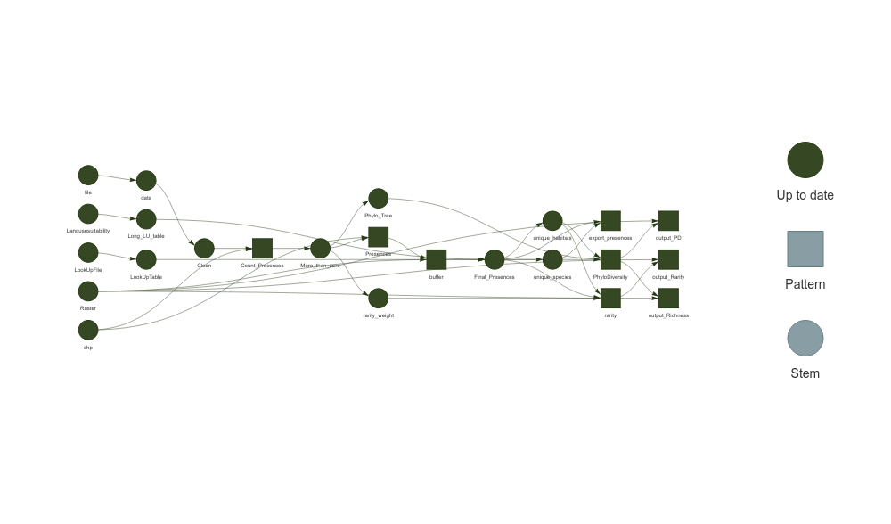
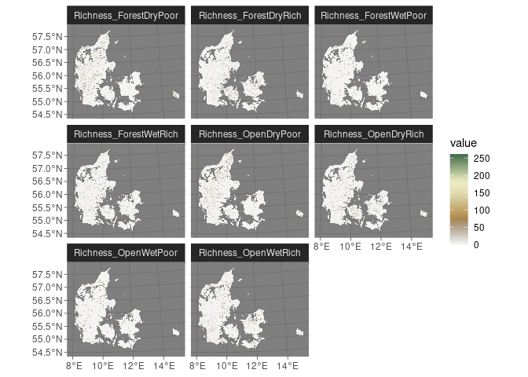
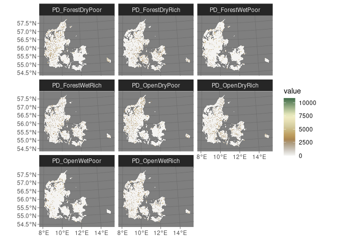
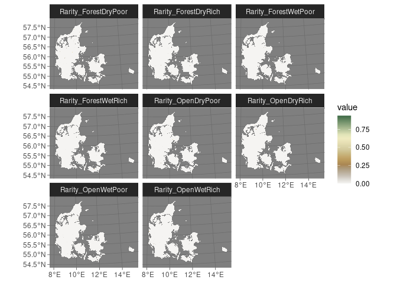

- [1 Ellenberg Based Biodiversity](#1-ellenberg-based-biodiversity)
  - [1.1 Environmental Gradient
    Categorization:](#11-environmental-gradient-categorization)
  - [1.2 Habitat Assignment:](#12-habitat-assignment)
  - [1.3 Implementation](#13-implementation)
- [2 Biodiversity estimation](#2-biodiversity-estimation)
  - [2.1 Partial usage of the SpeciesPoolR r
    package:](#21-partial-usage-of-the-speciespoolr-r-package)
- [3 Biodiversity patterns](#3-biodiversity-patterns)
  - [3.1 Species Richness](#31-species-richness)
  - [3.2 Phylogenetic diversity](#32-phylogenetic-diversity)
  - [3.3 Rarity](#33-rarity)
- [4 References](#4-references)

<!-- README.md is generated from README.Rmd. Please edit that file -->

# 1 Ellenberg Based Biodiversity

<!-- badges: start -->
<!-- badges: end -->

The goal of EllenbergBasedBiodiversity is to generate biodiversity
metrics based on Ellenberg values extracted from (Tichỳ et al. 2023),
for this

## 1.1 Environmental Gradient Categorization:

The averaged Ellenberg values are used to assign species into broad
habitat categories based on thresholds:

- **Light**: Species are categorized as belonging to either “Forest”
  (light \< 5), “Both” (\>= 5 and 8), “Open” (light \>= 8), or “Both” if
  the light value is missing.

- **Nutrients**: Species are classified as “Rich” (nutrients \> 4),
  “Poor” (nutrients ≤ 4), or “Both” if the nutrients value is missing.

- **Moisture**: Species are labeled as “Wet” (moisture \> 4) , “Both”
  4-8, “Dry” (moisture ≤ 4), or “Both” if the moisture value is missing.

## 1.2 Habitat Assignment:

The code constructs compound habitat categories by combining the three
dimensions:

Categories include combinations such as ForestDryPoor, OpenWetRich, etc.
If a species is categorized as “Both” in any dimension, it is duplicated
across both relevant categories. For instance:

A species categorized as “Forest, Dry, Both (Nutrients)” would be
assigned to both ForestDryPoor and ForestDryRich.

## 1.3 Implementation

The following R code performs the habitat assignment:

``` r
# Load necessary libraries
library(dplyr)
library(tidyr)
library(readxl)
```

After that we read the dataset with the species atributed to for
different habitats

``` r
# Read the Ellenberg table
ellenberg_table <- read_excel("EllembergTable.xlsx")
```

In table <a href="#tab:dimensionstable">1.1</a> we can see the first ten
observations of the dataset as an example

| Species                   | Open_Closed | Rich_Poor | wet_dry |
|:--------------------------|:------------|:----------|:--------|
| Acer campestre            | Both        | Both      | Both    |
| Acer platanoides          | Forest      | Both      | Both    |
| Acer pseudoplatanus       | Forest      | Both      | Both    |
| Achillea millefolium      | Both        | Both      | Both    |
| Achillea ptarmica         | Both        | Poor      | Both    |
| Achnatherum calamagrostis | Open        | Poor      | Both    |
| Actaea spicata            | Forest      | Both      | Both    |
| Adoxa moschatellina       | Forest      | Both      | Both    |
| Aegopodium podagraria     | Forest      | Both      | Both    |
| Agrimonia eupatoria       | Both        | Poor      | Both    |

<span id="tab:dimensionstable"></span>Table 1.1: Attributions of habitat
dimensions based on ellenberg values

We then generate a function to duplicate the rows for the Both Habitats

``` r
# function to generate habitats
generate_habitats <- function(data) {
  # Define possible replacements for "Both"
  open_closed_vals <- c("Forest", "Open")
  rich_poor_vals <- c("Poor", "Rich")
  wet_dry_vals <- c("Dry", "Wet")

  # Replace "Both" with all possible combinations efficiently
  data %>%
    rowwise() %>%
    mutate(
      Open_Closed = list(if (Open_Closed == "Both") open_closed_vals else Open_Closed),
      Rich_Poor = list(if (Rich_Poor == "Both") rich_poor_vals else Rich_Poor),
      wet_dry = list(if (wet_dry == "Both") wet_dry_vals else wet_dry)
    ) %>%
    unnest_longer(Open_Closed) %>%
    unnest_longer(Rich_Poor) %>%
    unnest_longer(wet_dry) %>%
    mutate(Habitat = paste0(Open_Closed, wet_dry, Rich_Poor)) %>%
    select(-Open_Closed, -Rich_Poor, -wet_dry) %>%
    ungroup()
}
```

and then we use it to generate the new lookup table based on Ellenberg
values

``` r
# Generate the habitats
expanded_ellenberg_table <- generate_habitats(ellenberg_table) |>
  dplyr::mutate(Pres = 1) |>
  magrittr::set_colnames(c("species", "Landuse", "Pres"))
```

The output will include a new column, Habitat, that contains the
compound habitat categories for each species, we can see the first ten
rows of this new dataset in table <a href="#tab:newlookup">1.2</a>.

| species          | Landuse       | Pres |
|:-----------------|:--------------|-----:|
| Acer campestre   | ForestDryPoor |    1 |
| Acer campestre   | ForestWetPoor |    1 |
| Acer campestre   | ForestDryRich |    1 |
| Acer campestre   | ForestWetRich |    1 |
| Acer campestre   | OpenDryPoor   |    1 |
| Acer campestre   | OpenWetPoor   |    1 |
| Acer campestre   | OpenDryRich   |    1 |
| Acer campestre   | OpenWetRich   |    1 |
| Acer platanoides | ForestDryPoor |    1 |
| Acer platanoides | ForestWetPoor |    1 |

<span id="tab:newlookup"></span>Table 1.2: New lookup table for habitats

then we can write it out as a csv file

``` r
readr::write_csv(expanded_ellenberg_table, "Lookup.csv")
```

# 2 Biodiversity estimation

## 2.1 Partial usage of the SpeciesPoolR r package:

Here we already have a LookupTable as the one generated by the
SpeciesPoolRPackage, here we wont need this, so we will use a simplified
version of the workflow in order to create the necessary Biodiversity
metrics (Rarity, Phylogenetic diversity and Species Richness), in order
to do that we will use a workflow using some of the SpeciesPoolR
functions, and the targets R package. In order to do that we first have
to load the necessary packages

``` r
library(targets)
library(SpeciesPoolR)
library(crew)
```

After this we run with targets a modified version of our prior

``` r
targets::tar_option_set(
  packages = c("SpeciesPoolR", "data.table"),
  controller = crew::crew_controller_local(workers = 6), error = "null"
)
list(
  targets::tar_target(file, command = "EllembergTable.xlsx", format = "file"),
  targets::tar_target(data, get_data(file, filter = NULL)),
  targets::tar_target(shp, command = NULL, format = "file"),
  targets::tar_target(Raster, command = "Dir/LU.tif", format = "file"),
  targets::tar_target(Landusesuitability, "NewHabSut.tif",
    format = "file"
  ), targets::tar_target(Clean, SpeciesPoolR::Clean_Taxa(data$Species)),
  targets::tar_target(Count_Presences, count_presences(Clean,
    country = "DK", shapefile = shp
  ), pattern = map(Clean)),
  targets::tar_target(More_than_zero, Count_Presences[N > 0, ,
    by = species, sum(N)
  ]), targets::tar_target(Presences,
    get_presences(More_than_zero$species,
      country = "DK",
      shapefile = shp, limit = 10000
    ),
    pattern = map(More_than_zero)
  ),
  targets::tar_target(buffer, make_buffer_rasterized(
    DT = Presences,
    file = Raster, dist = 500
  ), pattern = map(Presences)),
  targets::tar_target(LookUpFile, command = "Lookup.csv", format = "file"),
  targets::tar_target(
    LookUpTable,
    data.table::fread(LookUpFile)
  ),
  targets::tar_target(Long_LU_table, generate_long_landuse_table(path = Landusesuitability)),
  targets::tar_target(Final_Presences, make_final_presences(
    Long_LU_table,
    buffer, LookUpTable
  )), targets::tar_target(
    unique_species,
    unique(Final_Presences$species)
  ), targets::tar_target(
    unique_habitats,
    unique(Final_Presences$Landuse)
  ), targets::tar_target(export_presences,
    export_final_presences(Final_Presences[species == unique_species, ], folder = "Field_Final_Presences"),
    pattern = map(unique_species),
    format = "file"
  ), targets::tar_target(Phylo_Tree, generate_tree(More_than_zero)),
  targets::tar_target(rarity_weight, calc_rarity_weight(More_than_zero)),
  targets::tar_target(rarity, calc_rarity(Final_Presences[Landuse ==
    unique_habitats, ], rarity_weight), pattern = map(unique_habitats)),
  targets::tar_target(PhyloDiversity, calc_pd(Final_Presences[Landuse ==
    unique_habitats, ], Phylo_Tree), pattern = map(unique_habitats)),
  targets::tar_target(name = output_Rarity, command = export_rarity(
    Results = rarity,
    path = Raster
  ), map(rarity), format = "file"), targets::tar_target(
    name = output_Richness,
    command = export_richness(Results = PhyloDiversity, path = Raster),
    map(PhyloDiversity), format = "file"
  ), targets::tar_target(
    name = output_PD,
    command = export_pd(Results = PhyloDiversity, path = Raster),
    map(PhyloDiversity), format = "file"
  )
)
```

Here we can see a graphical implementation of the code

``` r
targets::tar_visnetwork()
```

<!-- -->

# 3 Biodiversity patterns

## 3.1 Species Richness

``` r
library(terra)
library(tidyterra)
library(ggplot2)
```

<div class="figure">



<p class="caption">

<span id="fig:Richness"></span>Figure 3.1: Potential species richness
for each of the habitat types

</p>

</div>

## 3.2 Phylogenetic diversity

<div class="figure">



<p class="caption">

<span id="fig:PD"></span>Figure 3.2: Potential phylogenetic diversity
for each of the habitat types

</p>

</div>

## 3.3 Rarity

<div class="figure">



<p class="caption">

<span id="fig:Rarity"></span>Figure 3.3: Potential rarity for each of
the habitat types

</p>

</div>

# 4 References

<div id="refs" class="references csl-bib-body hanging-indent"
entry-spacing="0">

<div id="ref-tichy2023ellenberg" class="csl-entry">

Tichỳ, Lubomı́r, Irena Axmanová, Jürgen Dengler, Riccardo Guarino,
Florian Jansen, Gabriele Midolo, Michael P Nobis, et al. 2023.
“Ellenberg-Type Indicator Values for European Vascular Plant Species.”
*Journal of Vegetation Science* 34 (1): e13168.

</div>

</div>
